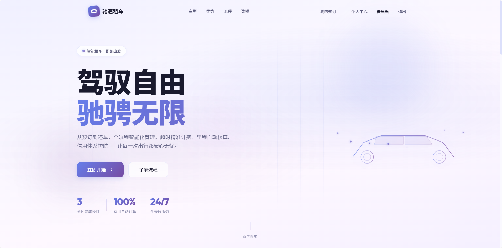
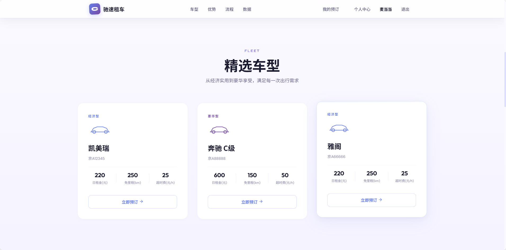
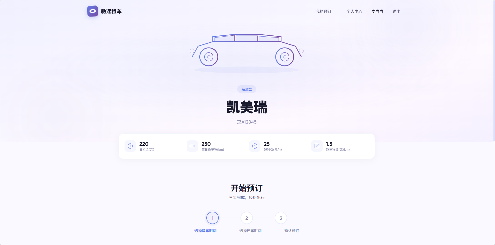
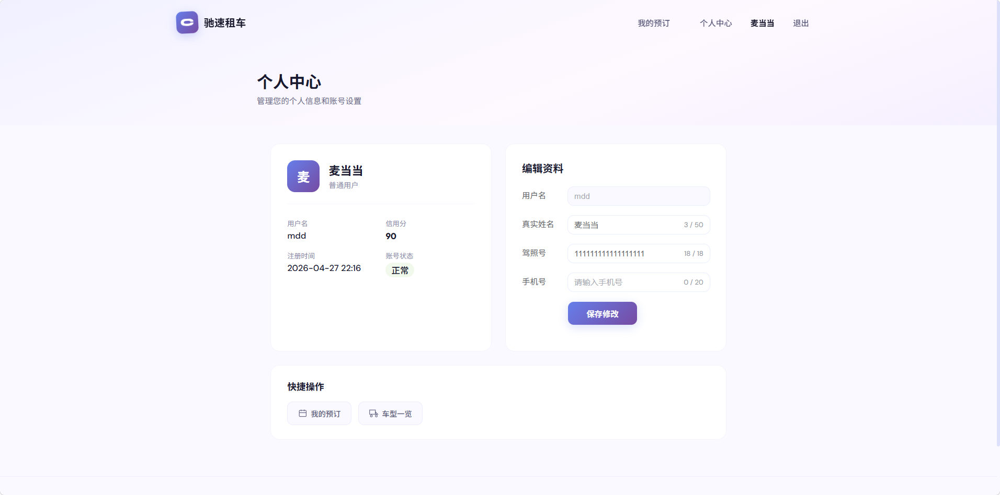
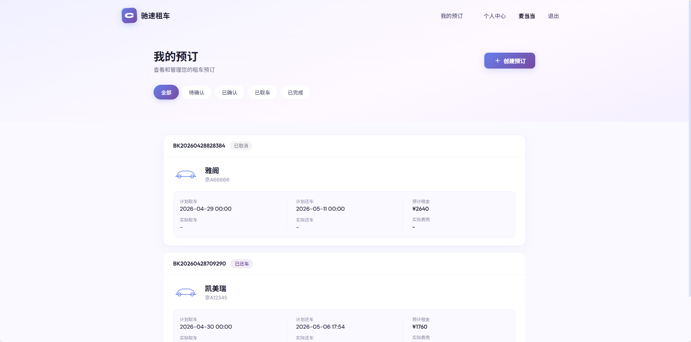
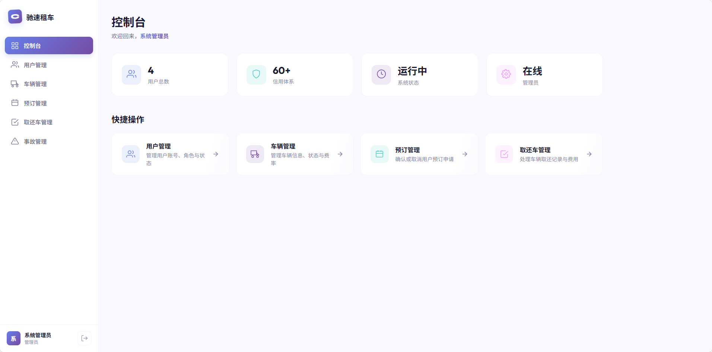
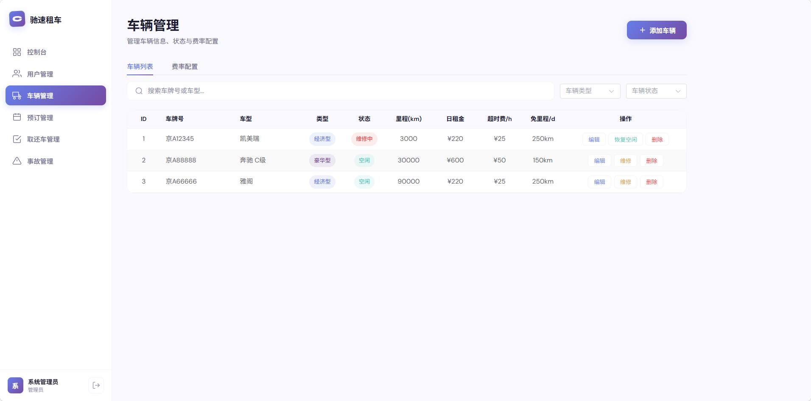

# 驰速租车管理系统

全栈租车管理平台 — 用户端支持车辆浏览、预订、取还车；管理端提供用户管理、车辆管理、预订管理、取还车处理、事故登记与信用分扣减。

## 技术栈

| 层级 | 技术 |
|---|---|
| 前端 | Vue 3 + Vite + Element Plus + Vue Router + Axios |
| 后端 | Spring Boot 3.2.5 + MyBatis-Plus 3.5.6 + JWT (jjwt 0.12.5) |
| 数据库 | MySQL 8.0 |
| 认证 | BCrypt 密码加密 + JWT 令牌鉴权 |

## 项目结构

```
car-rental-backend/          # Spring Boot 后端
├── src/main/java/com/carrental/
│   ├── common/              # 通用类（Result, PageResult, UserContext）
│   ├── config/              # 配置（CORS, Jackson, Security, 数据初始化）
│   ├── controller/          # REST 控制器
│   ├── dto/                 # 数据传输对象
│   ├── entity/              # 数据库实体
│   ├── exception/           # 全局异常处理
│   ├── interceptor/         # JWT 拦截器
│   ├── mapper/              # MyBatis-Plus Mapper
│   ├── service/             # 业务接口与实现
│   └── util/                # JWT 工具类
└── src/main/resources/
    ├── sql/schema.sql       # 数据库建表脚本
    ├── application.yml      # 主配置
    └── application-dev.yml  # 开发环境配置（需自行创建）

car-rental-frontend/          # Vue 3 前端
├── src/
│   ├── api/                 # API 请求封装
│   ├── components/          # 通用组件（导航栏、页脚、骨架屏等）
│   ├── router/              # Vue Router 路由配置
│   ├── utils/               # Axios 请求拦截器
│   ├── views/               # 页面组件
│   │   └── admin/           # 管理端页面
│   └── style.css            # 全局设计变量
└── vite.config.js           # Vite 配置（含 API 代理）
```

## 系统截图

### 用户端

| 首页 | 首页（精选车型） |
|---|---|
|  |  |

| 车辆详情 | 个人中心 |
|---|---|
|  |  |

| 我的预订 |
|---|
|  |

### 管理端

| 控制台 | 车辆管理 |
|---|---|
|  |  |

## 快速部署

### 环境要求

- JDK 17+
- Maven 3.6+
- Node.js 18+
- MySQL 8.0+

### 1. 数据库

创建数据库并导入建表脚本：

```sql
CREATE DATABASE IF NOT EXISTS car_rental
  DEFAULT CHARACTER SET utf8mb4
  DEFAULT COLLATE utf8mb4_unicode_ci;

USE car_rental;
SOURCE schema.sql;
```

或者直接导入根目录的 `schema.sql` 文件。

### 2. 后端

```bash
cd car-rental-backend

# 创建开发环境配置文件
cp src/main/resources/application-dev.yml.example \
   src/main/resources/application-dev.yml

# 编辑 application-dev.yml，填入你的数据库连接信息：
#   spring.datasource.url      — 数据库连接地址
#   spring.datasource.username — 数据库用户名
#   spring.datasource.password — 数据库密码

# 编译并启动（默认端口 8080）
mvn spring-boot:run
```

**JWT 密钥配置：** 生产环境请设置环境变量 `JWT_SECRET` 替换默认值。

```bash
export JWT_SECRET=your-256-bit-secret-key
```

### 3. 前端

```bash
cd car-rental-frontend

# 安装依赖
npm install

# 启动开发服务器（默认端口 5173）
npm run dev

# 生产构建
npm run build
```

前端开发服务器已配置 API 代理，`/api` 请求自动转发到 `http://localhost:8080`。

### 4. 访问

| 地址 | 说明 |
|---|---|
| http://localhost:5173 | 用户端首页 |
| http://localhost:5173/login | 用户登录 |
| http://localhost:5173/register | 用户注册 |
| http://localhost:5173/dashboard | 管理控制台（需管理员账号） |

## 默认账号

系统启动后自动初始化以下测试数据：

| 角色 | 用户名 | 密码 | 说明 |
|---|---|---|---|
| 管理员 | `admin` | `admin123` | 可访问管理后台 |
| 普通用户 | `testuser` | `test123` | 信用分 100 |
| 普通用户 | `li_customer` | `li123456` | 有历史订单 |
| 普通用户 | `zhang_customer` | `zhang123` | 信用分 75，有事故记录 |

测试车辆：凯美瑞（京A12345）、奔驰 C级（京A88888）、雅阁（京A66666）。

## API 概览

| 模块 | 端点 | 说明 |
|---|---|---|
| 认证 | `POST /api/auth/login` | 用户登录 |
| 认证 | `POST /api/auth/register` | 用户注册 |
| 用户 | `GET /api/users/me` | 获取当前用户信息 |
| 用户 | `PUT /api/users/me` | 更新个人信息 |
| 用户 | `GET /api/admin/users` | 用户管理列表（管理员） |
| 车辆 | `GET /api/vehicles` | 车辆列表 |
| 车辆 | `GET /api/vehicles/{id}` | 车辆详情 |
| 车辆 | `POST /api/admin/vehicles` | 添加车辆（管理员） |
| 预订 | `POST /api/bookings` | 创建预订 |
| 预订 | `GET /api/bookings` | 预订列表 |
| 预订 | `GET /api/bookings/my` | 我的预订 |
| 取还车 | `POST /api/rentals/pickup` | 取车 |
| 取还车 | `POST /api/rentals/return` | 还车 |
| 事故 | `POST /api/accidents` | 登记事故（管理员） |
| 事故 | `GET /api/accidents` | 事故列表（管理员） |
| 事故 | `PUT /api/accidents/{id}/process` | 处理事故（管理员） |
| 事故 | `PUT /api/accidents/{id}/complete` | 完成维修（管理员） |

## 业务流程

```
用户注册 → 浏览车辆 → 创建预订 → 管理员确认 →
到店取车 → 用车中 → 归还车辆 → 结算费用

事故处理：登记事故 → 扣减信用分 → 车辆维修 → 恢复空闲
信用分低于 60 分将冻结租车资格
```
